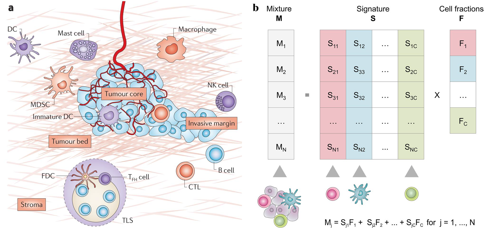
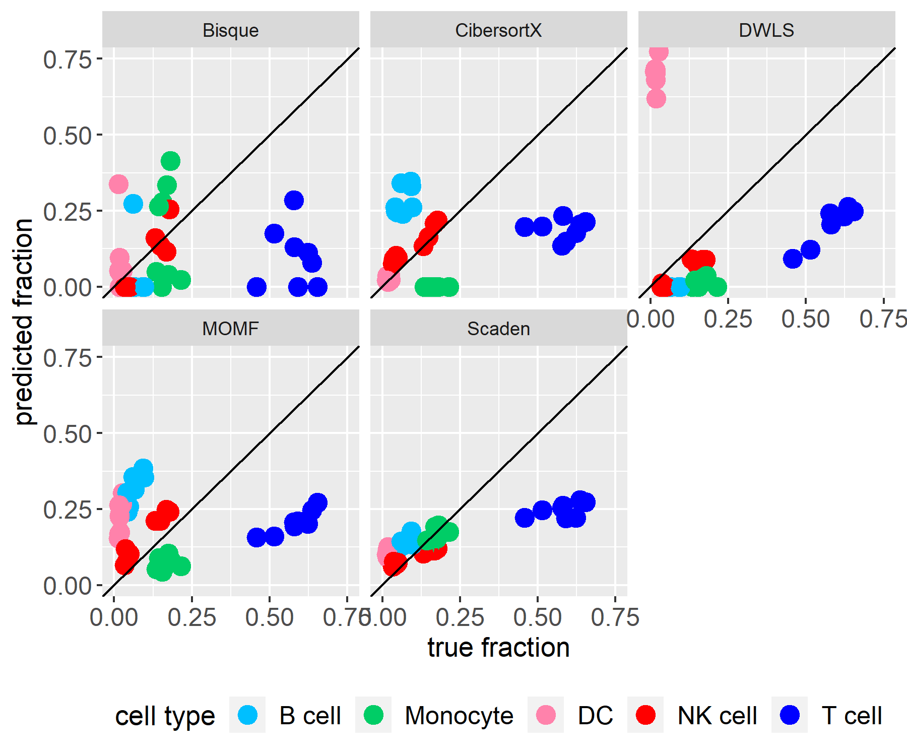
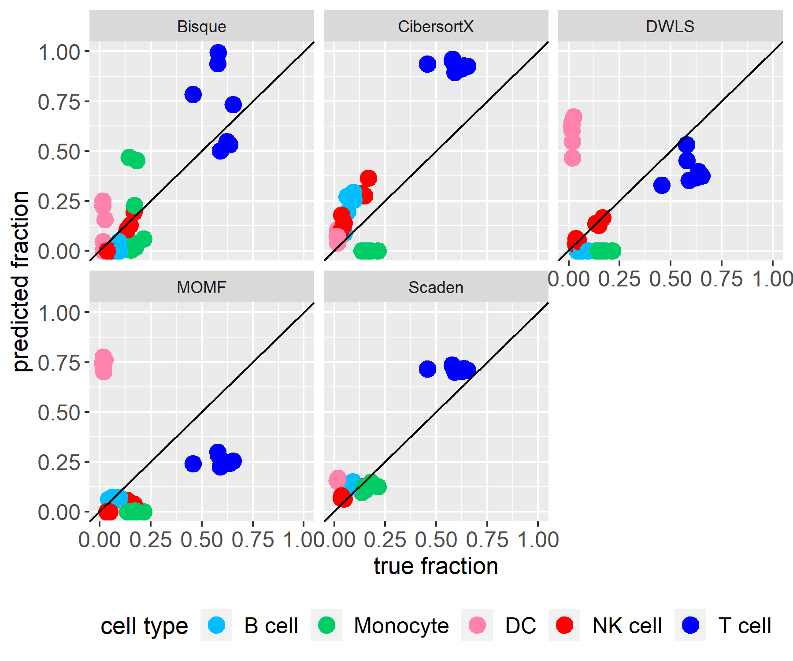

```{r, include = FALSE}
knitr::opts_chunk$set(
  fig.dpi = 96,
  collapse = TRUE,
  comment = "#>",
  tidy.opts=list(width.cutoff=60),
  tidy=TRUE,
  message = FALSE,
  warning = FALSE
)
```

# 1. Background
In the first section, we will give some background information about why cell-type deconvolution is necessary and how it works.

## Biological background
The prognosis of cancer and its progression is a challenging task. One of the reasons is that the type and abundance of immune cells in the tumor microenvironment (tumor immune infiltration) (Figure a) affect the outcome and the efficiency of immunotherapeutic strategies. Therefore, quantifying the composition of immune cells in tumor tissue is necessary. Previously, there have been several techniques like flow cytometry or immunohistochemistry IHC staining which can quantify tumor immune infiltration. However, they have technical or material limitations. A computational method without such limitation is therefore needed. 
     
     
## Computational background
```{r introductionFigure, echo=FALSE, out.width="80%", fig.align='center', fig.cap="Figure a by [@Fridman2017], Figure b by [@Finotello2018]"}

```
Cell-type deconvolution is a computational method to calculate cell type fraction from bulk RNA-seq data. This is done by leveraging precomputed expression signatures that represent the transcriptional profiles of the cell types of interest. The basic idea of cell-type deconvolution is that the gene expression of a sample equals the weighted sum of the contributions of different cell types. (Figure b) By extending the number of samples from 1 to m, an equation can be given as follows:  


$$ M = S \times F $$
$$(𝒏×𝒎)=(𝒏×𝒌)×(𝒌×𝒎)$$


$𝑀:$ Expression matrix of $n$ genes in $m$ samples.           
$𝑆:$ Specific gene expression values of $𝑘$ cell types          
$𝐹:$ Relative cell type proportions in each sample                

Therefore, the principle of cell-type deconvolution is that given $𝑀$ and $𝑆$, find $S$ to minimize the sum of square between $S×F$ and $𝑀$. 

## Previous works
Presently, there exists a package [immunedeconv](https://icbi-lab.github.io/immunedeconv/) built by the group of Gregor Sturm. It combines several first-generation deconvolution tools which use fixed, internal signature matrices that cover only a limited set of human cells. Nowadays, second-generation tools have been developed that allow deriving cell-type-specific expression signatures from single-cell RNA-seq (scRNA-seq). This enables the deconvolution of any cell type profiled with single-cell technologies. Therefore, these tools can extend their applicability to other cell phenotypes, tissues, diseases, and organisms.

Our interface unifies multiple second-generation deconvolution methods to facilitate the usage of these tools and clear the way for future benchmarking of these methods. 


# 2. Usage of Immunedeconv2

In this section, we want to present our package immunedeconv2 by first giving an overview about the basic functions and the showing an example workflow. 

## Installation and Setup

Install the CRAN package devtools and use it to install immunedeconv2 from [GitHub](https://github.com/):

``` {r installation, eval=FALSE}
install.packages("devtools")
devtools::install_github("PelzKo/immunedeconv2")
```

## Input Data

First of all, you need some data to run the deconvolution with. 

* Single cell RNA-seq data
    - *Genes* x *Cells* matrix 
    - Counts are *not log-transformed*
    - Rownames (gene names) are provided in the same format as in the bulk RNA-seq data, for instance HGNC symbols
* Cell type annotations
    - Vector containing cell type annotations
    - Annotations are in the same order as the columns of the single cell matrix
* Bulk RNA-seq data
    - *Genes* x *Samples* matrix
    - Rownames (gene names) are provided in the same format as in the sc RNA-seq data, for instance HGNC symbols
    
## Sample data
We also provide some sample data, a bigger and a smaller set of single cell RNA-seq matrix (subset of [@Maynard2020]), cell type annotations and bulk RNA-seq matrix [@Hoek2015]. 

The single cell RNA-seq matrix and the corresponding cell type annotations consist of immune cells that were obtained from clinical biopsies of metastatic lung cancer cells. They were profiled using the Smart-seq2 single cell technology. The bulk RNA-seq data from Hoek et al. consists of total RNA of blood samples of patients that were treated with an Influenza vaccination. The immune cells in these samples were purified and subjected to FACS, which offers a ground truth of the underlying cell proportions.

You can simply load the provided sample data with:

```r
data("single_cell_data")
data("cell_type_annotations")
data("bulk")
```
For the small dataset, append "_small" to the names, e.g. 
```r
data("single_cell_data_small")
```

## Signature Matrix

To calculate a cell-type-specific expression signature, you can use the build_model function with the single cell RNA-seq matrix and cell type annotations specified above. The parameter method can be set to one of the five methods listed below. More information of the methods is provided in section 3.

```{r signature, eval=FALSE}
immunedeconv2::build_model(single_cell_data, cell_type_annotations, method)
```

* Bisque ("bisque")
* DWLS ("dwls")
* MOMF ("momf")
* Scaden ("scaden")
* CibersortX ("cibersortx")

Note: MOMF and Scaden also require the bulk RNA-seq data to calculate a signature matrix. Please provide this parameter as well when running build_model with one of these two methods. 

Additional parameters for the different methods can be included in the method call as well. For further information on which options you have, see the documentation of each tool. 

## Deconvolution of Bulk RNA-seq Data

After building the specific signature matrix, you can calculate the cell properties in bulk RNA-seq data with the deconvolute function. For this, you need to provide the bulk data, signature matrix and you can, again, choose between the five methods listed in the previous section. 

```{r deconv, eval=FALSE}
immunedeconv2::deconvolute(bulk, signature_matrix, method)
```

Note: Bisque and MOMF additionally need the single cell RNA-seq matrix you used to build the signature matrix for their deconvolution. As a fifth parameter, Bisque also needs cell type annotations, which were already needed for building the model. 

Similar to the build_model function, specific parameters can be passed on to the deconvolution methods through the deconvolute function. 

## Example Workflow

```{r loaddata, echo=FALSE, results='hide'}
load("../data/cell_type_annotations.RData")
load("../data/bulk.RData")
load("../data/single_cell_data.RData")
load("../data/RefData.RData")
```

This workflow provides a more detailed example of how to run the deconvolution with Bisque. 

First of all, make sure you load all the libraries we need for this analysis. If the packages are not available, install them via install_packages().

```{r loadLibs}
library(tidyr)
library(dplyr)
library(immunedeconv2)
library(RColorBrewer)
library(ggplot2)
```

To give you a feeling for the data, this is what a few rows and columns of our small single cell RNA-seq dataset look like. This specific selection of rows and columns was performed as the first rows and columns just show zeros. Do not be alarmed by a great number of zeros in your single cell data, this is normal:

```{r showSc}
knitr::kable(single_cell_data[170:175, 9:13])
```

Now we build the signature matrix with Bisque and look at the values for the first few genes. 

```{r signatureExample}
signatureMatrix <- immunedeconv2::build_model(single_cell_data, cell_type_annotations, "bisque")
knitr::kable(signatureMatrix[1:5,])
```

We can use this signature matrix to run the deconvolution with Bisque. 

```{r deconvExample}
immunedeconv2::deconvolute(bulk, signatureMatrix, "bisque", single_cell_data, cell_type_annotations) %>%
knitr::kable()
```

## Plot Results

Additionally, we provide some methods for visualisation. In this and the benchmarking section you can find examples of how to use them. For the plotDeconvResult method, you can additionally provide a method and file name to add a title to your plot and save it. 

```{r plot, fig.width=7, fig.height=4}
res_bisque <- immunedeconv2::deconvolute(bulk, signatureMatrix, "bisque", single_cell_data, cell_type_annotations)
immunedeconv2::plotDeconvResult(res_bisque, method = "Bisque")
```

The scatterplot shown below depicts the same results and message as the barplot above, it is just another idea of how to visualize the results. Note that our package does not provide a method for this, but the plot can be recreated with this code.

```{r plot2, fig.width=7, fig.height=4}
data.frame(res_bisque, samples= rownames(res_bisque)) %>% pivot_longer(!samples, names_to ="cell_type", values_to="predicted_fraction") %>%
ggplot(aes(y=samples, x=predicted_fraction, color=cell_type))+geom_point(size=3)+facet_wrap(~cell_type)+labs(title="Bisque", y="sample", x="predicted fraction", color="cell type")+scale_fill_brewer(palette="Paired")
```

In the next figures you can see how the other methods are used and how the cell proportions would be distributed based on their calculations.
Here are some further ideas of how you could plot your deconvolution results. 

```{r otherMethods, fig.width=7, fig.height=4, results='hide', eval=FALSE}
res_momf <- immunedeconv2::build_model(single_cell_data, cell_type_annotations, "momf", bulk) %>%
immunedeconv2::deconvolute(bulk_gene_expression = bulk, method = "momf", single_cell_object = single_cell_data)
immunedeconv2::plotDeconvResult(res_momf, method = "MOMF")
res_scaden <- immunedeconv2::build_model(single_cell_object = single_cell_data, cell_type_annotations = cell_type_annotations, method = "scaden", bulk) %>%
 immunedeconv2::deconvolute(bulk_gene_expression = bulk, method = "scaden", single_cell_object = single_cell_data)
immunedeconv2::plotDeconvResult(res_scaden, method = "Scaden")
res_dwls <- immunedeconv2::build_model(single_cell_data, cell_type_annotations, "dwls") %>%
immunedeconv2::deconvolute(bulk_gene_expression = bulk, method = "dwls")
immunedeconv2::plotDeconvResult(res_dwls, method = "DWLS")
res_ciber <- immunedeconv2::build_model(single_cell_data, cell_type_annotations, "cibersortx") %>%
immunedeconv2::deconvolute(bulk_gene_expression = bulk, method = "cibersortx")
immunedeconv2::plotDeconvResult(res_ciber, method = "CibersortX")
```
```{r plots, echo=FALSE, out.width="80%"}
knitr::include_graphics("images/momf_prop.png")
knitr::include_graphics("images/scaden_prop.png")
knitr::include_graphics("images/dwls_prop.png")
knitr::include_graphics("images/cibersortx_prop.png")
```

# 3. Methods
In this section, we provide a short overview over the deconvolution methods that can be used via this package.

Please note that even though our package is freely available, the second generation immune deconvolution methods may not be. For instance, the usage of CibersortX requires a token bound to your IP address. For more information and to request such a token, please see the official website [CIBERSORTX](https://cibersortx.stanford.edu/).

```{r mehods_table, echo=FALSE, out.width="80%"}
knitr::include_graphics("images/methods_table.png")
```

## Bisque
Bisque [@Jew2020] takes advantage of matched bulk and scRNA-seq samples to improve accuracy of cell-type estimates. Using linear regression, it corrects for platform-specific biases between pseudo-bulk reference profiles derived from scRNA-seq and bulk RNA-seq samples. It then applies NNLS-regression to deconvolute other bulk RNA-seq samples.

## CibersortX
CIBERSORTx [@Newman2019] is an extension to the original CIBERSORT algorithm [@Newman2015] that enables building signature matrices from scRNA-seq or sorted bulk RNA-seq samples based on differential gene expression analysis. To address technical biases they introduce two batch correction methods, one designed to mitigate batch effects between datasets, the other to address differences between sequencing protocols (e.g. 10x vs. full-length). Moreover, CIBERSORTx supports “complete” deconvolution, not only yielding cell-type proportions but disentangling bulk gene expression profiles into cell-type specific expression profiles.

## DWLS
Tsoucas et al. introduce dampened weighted least squares (DWLS)-regression [@Tsoucas2019], which improves over ordinary least squares regression or 𝜈-SVR in that it attributes higher weight to rare cell types and marker genes with a low average expression level. They show that their method achieves favorable performance when estimating the abundance of infrequent cell-types.

## MOMF
With MOMF [@Sun2019], Multi-Omics Matrix Factorization, models the cell type specific mean in scRNA-seq data by also accounting for the uncertainty of these cell type specific mean gene expression levels. Alternating Direction Method of Multipliers algorithm is then used to estimate the parameters in bulk RNA-seq downstream analyses. 

## Scaden
Scaden [@Mendeneaba2619] leverages a deep neural network (DNN) for estimating cell-type proportions. Instead of explicitly building a signature matrix, the DNN implicitly learns which features are important for a certain cell type. The DNN is trained by simulating bulk RNA-seq samples with known cell-type proportions from scRNA-seq datasets. To increase robustness, the training process allows to flexibly integrate multiple scRNA-seq datasets and, optionally, bulk RNA-seq samples with “gold standard” measurements such as FACS.


# 4. Benchmarking
To evaluate the performance of the methods used, we compared a data set with 17k cells [@Hoek2015] to its ground truth, measured with FACS. This data is also included in our benchmarking method, which takes the desired filename and -type as a parameter, as a testset.

For this comparison, a perfect estimation of cell type fractions by one method would include that all points align to the diagonal line in the according facet.

## Prediction results

In the two figures shown below, both bulk and single cell RNA-seq data are TPM normalized. This is the standard for this kind of data and our test data sets contain TPM normalized values as well.

```{r benchmarking, fig.width=6, fig.height=7, eval=FALSE}
result_list <- c(Bisque = res_bisque, CibersortX = res_ciber, DWLS = res_dwls, MOMF = res_momf, Scaden = res_scaden)
immunedeconv2::makeBenchmarkingScatterplot(result_list, "predictionVsGroundtruth.png")
```
```{r benchmarkingFigure, echo=FALSE, out.width="80%"}
knitr::include_graphics("images/propgrid_tpm.png")

```

All in all, the methods differ a lot in their predictions. Bisque shows very heterogenous results, which might be induced by its deconvolution method. More details on that are provided a few figures below. Predictions from Scaden, on the other hand, seem to be closest to the ground truth, even though the prediction of the T cell fraction is way off and also the dendritic cells are not that accurate. The results for these two cell types are very interesting, as all methods calculate their proportion wrong.

The inaccuracy of the prediction of T cells could be induced by TPM normalization. To evaluate this theory, we analyzed the deconvolution results for unnormalized single cell RNA-seq and bulk RNA-seq data as well. The comparison of these predictions can be found in the figure below. 

```{r benchmarkingFigureNonNormalized, echo=FALSE, out.width="80%"}
knitr::include_graphics("images/propgrid_counts.png")

```

The predictions for the different cell type fractions still differ a lot between the methods, as can be seen in the barplot. However, without TPM normalization, the predictions for T cell fractions are slightly more accurate. This is probably due to the fact that TPM normalization removes the information about cell size and therefore how much mRNA is present. As T cells account for the bigger cells in our immune system, this "counts per cell" normalization method might not be a perfect fit for immune deconvolution. 

In contrast to the T cells, the predictions for dendritic cell fractions are still very off. This phenomenon was already detected in the benchmarking of first-generation immune deconvolution methods performed by Sturm et al. [@Sturm2019]

## Comparison with first-generation deconvolution methods

Another very important question is, how good the second-generation tools are in comparison to the first-generation deconvolution methods. For that purpose, we compared EPIC, quanTIseq, two first-generation methods with their default parameters, with Scaden. We chose these methods, since they showed a good performace in the benchmarking by Sturm et al. [@Sturm2019]. The deconvolution was based on unnormalized data. 

```{r benchmarkingFirstGen, echo=FALSE, out.width="80%"}
knitr::include_graphics("images/predictionVsGroundtruth_unnormalized_firstGeneration.png")
```

As already addressed in section 1, first-generation deconvolution tools use fixed, internal signature matrices containing only a limited set of human cells. Second-generation tools bring more flexibility as they allow the Derivation of cell-type specific signature matrices.

The advantage of fixed signature matrices is that they can be modulated to fit to the bulk data very well. This is why quanTIseq and EPIC produce very good predicitions in comparison to Scaden. However, other datasets might not be suitable for these two methods. Furthermore, Scaden does not fall behind regarding its precision, especially when compared to EPIC.

However, this was just a small benchmark with one dataset. Different datasets of different disease progressions and cell proportions might show additional advantages or disadvantages of the methods. Generally it can be said that second-generation tools provide other functionality and thus make a good addition to the deconvolution package.

## Signature interchangeability

Since second-generation decovolution methods allow to derive cell-type-specific expression signatures from single-cell RNA-seq (scRNA-seq) as well as let the user provide their own signature matrix, the possibility of interchanging signature matrices needs to be examined. 

Scaden is an exception as it does not produce a signature matrix but a perceptron.

It is now possible to use every method which takes in a signature matrix (everything except Scaden) with all other signature methods. This is done by intersecting the genes of the bulk data, single cell data and the signature matrix. In theory, this should not remove any data, as most methods are unable to run with a different number of genes in the signature matrix and the rest of the data. Nevertheless, this property should be evaluated when the whole packages is benchmarked in detail.

```{r benchmarkingInterchangeMatrix, echo=FALSE}
knitr::kable(data.frame(Deconv_method=c("Bisque", "CibersortX", "DWLS", "MOMF", "Scaden"), Bisque=c("yes", "yes", "yes", "yes", "-"), CibersortX=c("yes", "yes", "yes", "yes", "-"), DWLS=c("yes", "yes", "yes", "yes", "-"), MOMF=c("yes", "yes", "yes", "yes", "-"), Scaden=c("-", "-", "-", "-", "yes")), caption = "Interchangeability table: 'Yes' indicates, that a signature matrix built by the method in the according column can be used for deconvolution with the method from the according row.")
```

```{r benchmarkingInterchangePlots, echo=FALSE, out.width="45%"}
knitr::include_graphics("images/ciber_matrices.png")
knitr::include_graphics("images/dwls_matrices.png")
knitr::include_graphics("images/bisque_matrices.png")
knitr::include_graphics("images/momf_matrices.png")
```

As can be concluded from this figure, interchanging matrices between the methods does not considerably improve the predictions. One might derive small improvements especially when building the signature matrix with Bisque or CibersortX, but the reason behind this needs further examination in the future.

# 5. Distribution of work

We regularly met and were all involved in the general decision making process. This list refers to who did the most work on those topics/who was mainly responsible:

* Katharina: Implementation of MOMF, ReadMe, First edition of Vignette, Visualisation, Sample Data Sets, Benchmarking
* Konstantin: Implementation of Bisque and CibersortX, Benchmarking, General Coordination and Planning
* Nicolas: Implementation of Scaden, Unit tests, Data conversion methods
* Yuyu: Implementation of DWLS, Continuous Integration, Documentation Website


# 6. Reference

