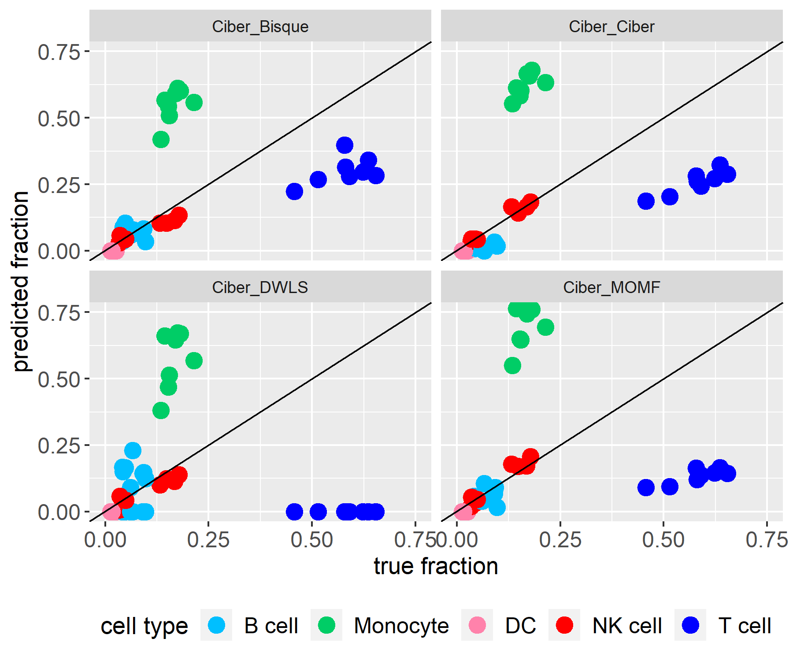
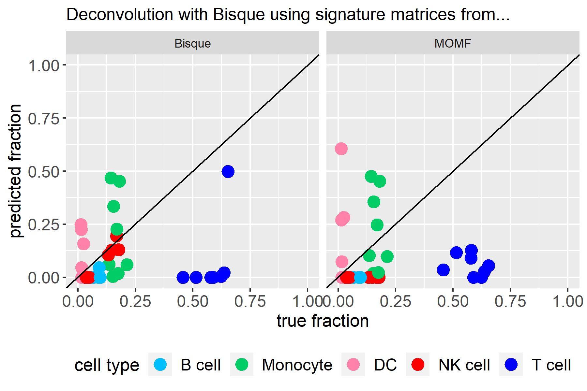
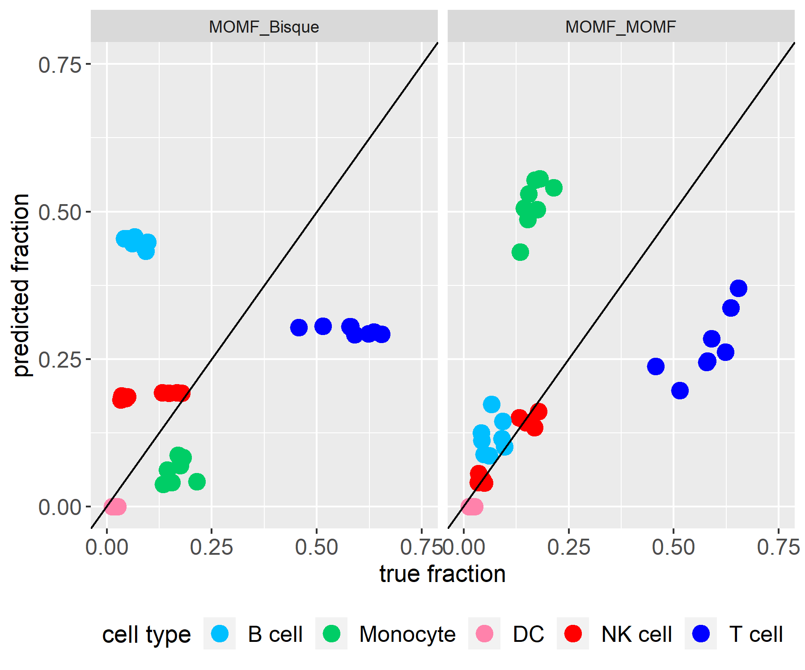
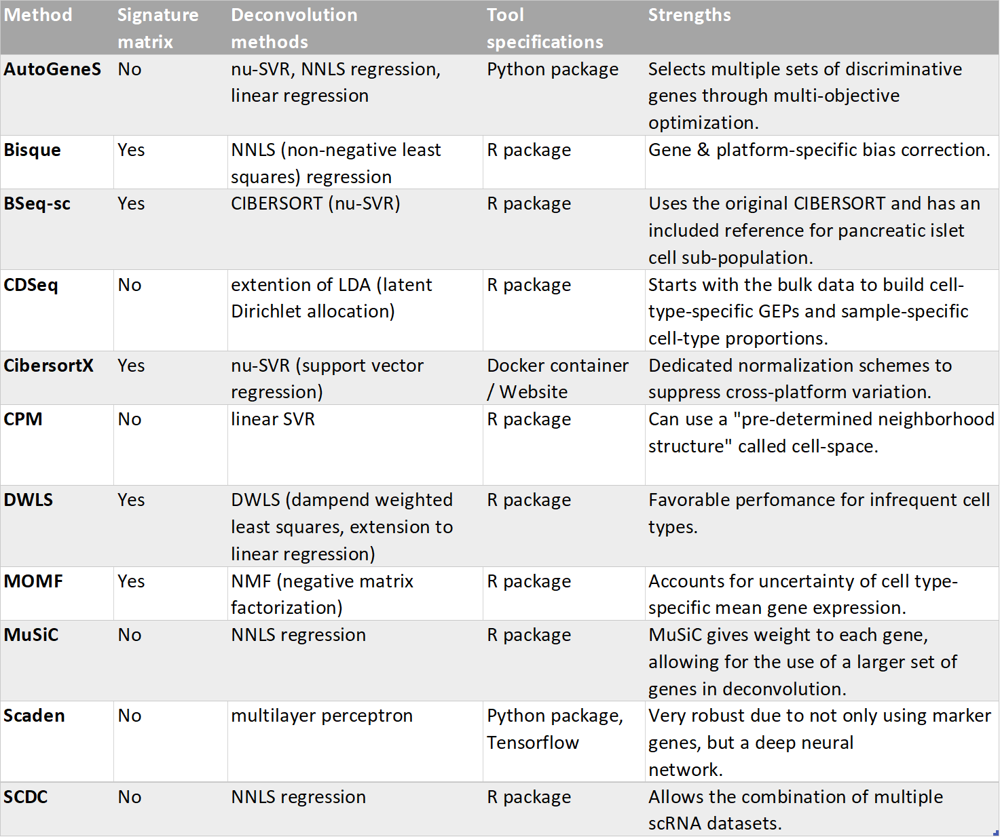

```{r, include = FALSE}
knitr::opts_chunk$set(
  fig.dpi = 96,
  collapse = TRUE,
  comment = "#>",
  tidy.opts = list(width.cutoff = 60),
  message = FALSE,
  warning = FALSE
)


library(omnideconv)
omnideconv::install_all_python()
```

```{r Logo, echo=FALSE, out.width="80%"}

```

# 1. Background
In the first section, we will give some background information about why cell-type deconvolution is necessary and how it works.

## Biological Background
The prognosis of cancer and its progression is a challenging task. One of the reasons is that the type and abundance of immune cells in the tumor microenvironment (tumor immune infiltration) (Figure 1a) affect the outcome and the efficiency of immunotherapeutic strategies. Therefore, quantifying the composition of immune cells in tumor tissue is necessary. Previously, there have been several techniques like flow cytometry or immunohistochemistry IHC staining which can quantify tumor immune infiltration. However, they have technical or material limitations. A computational method without such limitation is therefore needed. 
     
     
## Computational Background

```{r introductionFigure, echo=FALSE, out.width="100%", fig.cap="Figure 1: (a) Recruitment and maintenance of Treg cells in the tumor microenvironment. [@Plitas2020] (b) Visualisation of the mathematics behind cell deconvolution. [@Finotello2018]"}
knitr::include_graphics("images/introduction.jpg")
```
Cell-type deconvolution is a computational method to calculate cell type fraction from bulk RNA-seq data. This is done by leveraging precomputed expression signatures that represent the transcriptional profiles of the cell types of interest. The basic idea of cell-type deconvolution is that the gene expression of a sample equals the weighted sum of the contributions of different cell types. (Figure 1b) By extending the number of samples from 1 to m, an equation can be given as follows:  


$$ M = S \times F $$
$$(𝒏×𝒎)=(𝒏×𝒌)×(𝒌×𝒎)$$


$𝑀:$ Expression matrix of $n$ genes in $m$ samples.           
$𝑆:$ Specific gene expression values of $𝑘$ cell types          
$𝐹:$ Relative cell type proportions in each sample                

Therefore, the principle of cell-type deconvolution is that given $𝑀$ and $𝑆$, find $S$ to minimize the sum of square between $S×F$ and $𝑀$. 

## Previous Works
Presently, there exists a package [immunedeconv](https://icbi-lab.github.io/immunedeconv/) [@Sturm2019]. It combines several first-generation deconvolution tools which use fixed, internal signature matrices that cover only a limited set of human cells. Nowadays, second-generation tools have been developed that allow deriving cell-type-specific expression signatures from single-cell RNA-seq (scRNA-seq). This enables the deconvolution of any cell type profiled with single-cell technologies. Therefore, these tools can extend their applicability to other cell phenotypes, tissues, diseases, and organisms. This is often done through two steps: One for the creation of a signature matrix and one for the deconvolution with this signature matrix.

Our interface unifies multiple second-generation deconvolution methods to facilitate the usage of these tools and clear the way for future benchmarking of these methods. 


# 2. Usage of omnideconv

In this section, we want to present our package omnideconv by first giving an overview about the basic functions and the showing an example workflow. 

## Installation and Setup

Please refer to the Readme for the installation and setup instructions.

## Input Data

First of all, you need some data to run the deconvolution with. 

* Single cell RNA-seq data
    - *Genes* x *Cells* matrix 
    - Counts are *not log-transformed*
    - Rownames (gene names) are provided in the same format as in the bulk RNA-seq data, for instance HGNC symbols
* Cell type annotations
    - Vector containing cell type annotations
    - Annotations are in the same order as the columns of the single cell matrix
* Batch ids
    - Vector containing batch ids, so sample or patient ids
    - Ids are in the same order as the columns of the single cell matrix
    - This is only necessary for Bisque, MuSiC and SCDC
* (Marker genes)
    - Vector containing gene names
    - This is only necessary for BSeq-sc
* Bulk RNA-seq data
    - *Genes* x *Samples* matrix
    - Rownames (gene names) are provided in the same format as in the sc RNA-seq data, for instance HGNC symbols
    
    
<!--

## Input Data Type

TODO

```{r inputDataTypeMatrix, eval=FALSE, echo=FALSE, results='hide'}
knitr::kable(data.frame(
  Deconv_method = c("raw counts", "TPM", "library-normalized counts", "log scale", "natural scale"),
  AutoGeneS = c("yes", "yes", "yes", "yes", "yes"),
  Bisque = c("yes", "yes", "yes", "yes", "yes"),
  BSeq_sc = c("yes", "yes", "yes", "yes", "yes"),
  CDSeq = c("yes", "yes", "yes", "yes", "yes"),
  CIBERSORTx = c("yes", "yes", "yes", "yes", "yes"),
  CPM = c("yes", "yes", "yes", "yes", "yes"),
  DWLS = c("yes", "yes", "yes", "yes", "yes"),
  MOMF = c("yes", "yes", "yes", "yes", "yes"),
  MuSiC = c("yes", "yes", "yes", "yes", "yes"),
  Scaden = c("yes", "yes", "yes", "yes", "yes"),
  SCDC = c("yes", "yes", "yes", "yes", "yes")
),
caption = "Table X: Bla bla"
)
```
   
-->
    
## Sample Data
We also provide some sample data, three sets of single cell RNA-seq matrices (subset of [@Hao2021]), cell type annotations and one bulk RNA-seq matrix [@Hoek2015]. The single cell data contains raw counts, while the bulk data is already TPM-normalized.

The single cell RNA-seq matrix and the corresponding cell type annotations consist of human peripheral blood mononuclear cells that were obtained from eight volunteers enrolled in an HIV vaccine trial. They were profiled using the 10x single cell technology.
The bulk RNA-seq data from Hoek et al. consists of total RNA of blood samples of patients that were treated with an Influenza vaccination. The immune cells in these samples were purified and subjected to fluorescence activated cell sorting (FACS), which offers a ground truth of the underlying cell proportions.

You can simply load the three provided sample data like this, just substitute NUMBER with 1, 2 or 3:

```r
data("single_cell_data_NUMBER")
# Example:
# data("single_cell_data_1")
data("cell_type_annotations_NUMBER")
data("batch_ids_NUMBER")
data("bulk")
```

## Signature Matrix

To calculate a cell-type-specific expression signature, you can use the build_model function with the single cell RNA-seq matrix (rows are genes, columns are samples) and cell type annotations specified above. Alternatively a SingleCellExperiment or an AnnData object can be provided. The parameter method can be set to one of the five methods listed below. More information of the methods is provided in section 3.

```{r signature, eval=FALSE}
omnideconv::build_model(single_cell_data, cell_type_annotations, method)

# Bseq-sc requires the batch ids and marker genes for each cell type
omnideconv::build_model(single_cell_data, cell_type_annotations,
  method,
  batch_ids = batch_ids, markers = markers
)
# MOMF and Scaden require the bulk RNA-seq data as well
omnideconv::build_model(single_cell_data, cell_type_annotations,
  method,
  bulk_gene_expression = bulk
)
```

These methods are currently implemented (and in brackets is how to call them in the interface)

* AutoGeneS ("autogenes")
* Bisque ("bisque")
* BSeq-sc ("bseqsc")
* CDSeq ("cdseq")
* CIBERSORTx ("cibersortx") 
* CPM ("cpm")
* DWLS ("dwls")
* MOMF ("momf")
* MuSiC ("music")
* Scaden ("scaden")
* SCDC ("scdc")

Additional parameters for the different methods can be included in the method call as well. For further information on which options you have, see the documentation of each tool by calling ?omnideconv::build_model_METHODNAME (e.g. ?omnideconv::build_model_bseqsc). 

## Deconvolution of Bulk RNA-seq Data

After building the specific signature matrix, you can calculate the cell properties in bulk RNA-seq data with the deconvolute function. For this, you need to provide the bulk data, signature matrix and you can, again, choose between the methods listed in the previous section. The deconvolution approach of the specified method is then used with your bulk data and your signature matrix. An exception are CDSeq, CPM, MuSiC and SCDC which do not require a signature matrix, as they do everything in one step and the build method is neither required nor used. AutoGeneS and Scaden require their .pickle file or perceptron, created in their build_model step.

```{r deconv, eval=FALSE}
omnideconv::deconvolute(bulk, signature_matrix, method)


# MOMF requires the single cell data for deconvolution
omnideconv::deconvolute(bulk, signature_matrix, "momf",
  single_cell_object = single_cell_data,
  cell_type_annotations = cell_type_annotations
)
# CPM requires the single cell data for deconvolution, while not requiring a signature matrix
omnideconv::deconvolute(bulk, "cpm",
  single_cell_object = single_cell_data,
  cell_type_annotations = cell_type_annotations
)
# Bisque, CDSeq, MuSiC and SCDC require the single cell data and the batch ids, while not
# requiring a signature matrix
omnideconv::deconvolute(bulk, method,
  batch_ids = batch_ids,
  single_cell_object = single_cell_data,
  cell_type_annotations = cell_type_annotations
)
```

Similar to the build_model function, specific parameters can be passed on to the deconvolution methods through the deconvolute function. See all options for the specific method by calling ?omnideconv::deconvolute_METHODNAME (e.g. ?omnideconv::deconvolute_autogenes).

## Example Workflow

This workflow provides a more detailed example of how to run the deconvolution with Bisque. 

First of all, make sure you load all the libraries we need for this analysis. If the packages are not available, install them via install_packages().

```{r loadLibs}
library(tidyr)
library(dplyr)
library(omnideconv)
library(RColorBrewer)
library(ggplot2)
```

Then we load one of the example data sets to work with.

```{r loaddata}
data("single_cell_data_1")
data("cell_type_annotations_1")
data("batch_ids_1")
data("bulk")
data("RefData")

# This is just to make the variables nicer to work with
single_cell_data <- single_cell_data_1
cell_type_annotations <- cell_type_annotations_1
batch_ids <- batch_ids_1
```

To give you a feeling for the data, this is what a few rows and columns of our small single cell RNA-seq data set look like. This specific selection of rows and columns was performed as the first rows and columns just show zeros. Do not be alarmed by a great number of zeros in your single cell data, this is normal:

```{r echo=FALSE}
knitr::kable(single_cell_data[67:71, 1:3],
  caption = "Table 1: Example of the raw single cell counts.",
  digits = 3
)
```

Now we build the signature matrix with MOMF and look at the values for the first few genes. 

```{r signatureExample}
signatureMatrix <- omnideconv::build_model(
  single_cell_data, cell_type_annotations,
  "momf",
  bulk_gene_expression = bulk
)
```
```{r echo=FALSE}
knitr::kable(signatureMatrix[1:5, ],
  caption = "Table 2: Part of the signature matrix created with MOMF."
)
```

We can use this signature matrix to run the deconvolution with DWLS, MOMF, BSeq-sc or CibersortX. We can also use one of the methods which combines both steps in one like Bisque and thus takes in the signature NULL.

```{r deconvExample}
deconvolution <- omnideconv::deconvolute(
  bulk, NULL, "bisque", single_cell_data,
  cell_type_annotations, batch_ids
)
```
```{r echo=FALSE}
knitr::kable(deconvolution,
  caption = "Table 3: Deconvoluted cell type proportions calculated
  with Bisque.", digits = 3
)
```

## Plot Results

Additionally, we provide some methods for visualisation. In this and the benchmarking section you can find examples of how to use them. For the make_barplot method, you can additionally provide a method and file name to add a title to your plot and save it. The colors are assigned in the order of the alphabet. As long as the exact same cell types are used throughout the analysis, the color assigned to each cell type will be the same.

Please note that the cell fractions depicted in this section are not representative for deconvolution analysis of "real" data. They are based on our sample dataset, which is very small compared to the usual datasets used in deconvolution analysis and also contains a limited number of cell types. Using such a small subset leads to a big information loss and the results are biased. However, the goal of this section is to give an example how the results can be visualized and to draw attention to the big differences between the results of the eleven methods implemented.

```{r plot, fig.width=7, fig.height=4, fig.cap="Figure 2: Cell type proportions of the last step visualized with very heterogenous results."}
res_bisque <- deconvolution # Taking the computed values of the last step
res_bisque_list <- list(deconvolution)
names(res_bisque_list) <- "Bisque"
omnideconv::make_barplot(res_bisque_list, title = "Deconvolution result")
```

The scatterplot shown below depicts the same results and message as the barplot above, it is just another idea of how to visualize the results. Note that our package does not provide a method for this, but the plot can be recreated with this code.

```{r plot2, fig.width=7, fig.height=4, fig.cap="Figure 3: Same cell type proportions as in Figure 2, just visualized on a cell type level."}
data.frame(res_bisque, samples = rownames(res_bisque)) |>
  pivot_longer(!samples, names_to = "cell_type", values_to = "predicted_fraction") |>
  ggplot(aes(y = samples, x = predicted_fraction, color = cell_type)) +
  geom_point(size = 3) +
  facet_wrap(~cell_type) +
  labs(title = "Bisque", y = "sample", x = "predicted fraction", color = "cell type") +
  scale_fill_brewer(palette = "Paired")
```

# 3. Comparing Methods
To evaluate the performance of the methods used, we compared a data set with 17k cells [@Hoek2015] to its ground truth, measured with FACS. This data is also included in our benchmarking method, which takes the desired filename and -type as a parameter, as a testset.

For this comparison, a perfect estimation of cell type fractions by one method would imply that all points align to the diagonal line.

Detailed information about the methods can be found in section 4.

## Prediction Results

In the two figures shown below, the single cell RNA-seq data contains counts while the bulk RNA-seq data is TPM normalized. Our test data sets contain TPM normalized values as well.
The graphic looks a little different from the last deconvolution plot, as we combined CD4 and CD8 T-cells here to compare the method results to the ground truth.

```{r benchmarking, fig.width=7, fig.height=3, fig.align='center'}
pickle_path_autogenes <- build_model(single_cell_data, cell_type_annotations, "autogenes")
res_autogenes <- deconvolute(bulk, pickle_path_autogenes, "autogenes")

# SCDC does not require the build_model step
res_scdc <- deconvolute(bulk, NULL, "scdc", single_cell_data, cell_type_annotations, batch_ids)

# res_bisque was already calculated before
result_list <- list(AutoGeneS = res_autogenes, Bisque = res_bisque, SCDC = res_scdc)

# This joins CD4 and CD8 T cells into on class so it can be compared with the reference data
result_list <- lapply(result_list, function(x) {
  if ("CD4 T" %in% colnames(x)) {
    cbind(x, T = (x[, "CD4 T"] + x[, "CD8 T"]))[, -c(2, 3)]
  } else {
    x
  }
})
omnideconv::make_benchmarking_scatterplot(result_list, RefData)
omnideconv::make_barplot(result_list, "Comparison of different deconvolution methods")
```

<!--

## Comparison with First-Generation Deconvolution Methods

Another very important question is, how good the second-generation tools are in comparison to the first-generation deconvolution methods. For that purpose, we compared EPIC, quanTIseq, two first-generation methods with their default parameters, with Scaden. We chose these methods, since they showed a good performace in the benchmarking by Sturm et al. [@Sturm2019]. The deconvolution was based on unnormalized data. 

TODO: Multiple examples, one of immunecell tissue, one of others


```{r benchmarkingFirstGen, echo=FALSE, out.width="80%", fig.cap="Figure 7: Comparison of using the unnormalized count data for the deconvolution with two first generation tools (EPIC and quanTIseq) and one second generation tool (Scaden)."}
knitr::include_graphics("images/predictionVsGroundtruth_unnormalized_firstGeneration.png")
```


As already addressed in section 1, first-generation deconvolution tools use fixed, internal signature matrices containing only a limited set of human cells. Second-generation tools bring more flexibility as they allow the Derivation of cell-type specific signature matrices.

The advantage of fixed signature matrices is that they can be modulated to fit to the bulk data very well. This is why quanTIseq and EPIC produce very good predicitions in comparison to Scaden. However, other datasets might not be suitable for these two methods. Furthermore, Scaden does not fall behind regarding its precision, especially when compared to EPIC.

However, this was just a small benchmark with one dataset. Different datasets of different disease progressions and cell proportions might show additional advantages or disadvantages of the methods. Generally it can be said that second-generation tools provide other functionality and thus make a good addition to the deconvolution package.

-->

## Signature Interchangeability

Since most second-generation decovolution methods allow to derive cell-type-specific expression signatures from single-cell RNA-seq (scRNA-seq) as well as let the user provide their own signature matrix, the possibility of interchanging signature matrices needs to be examined. 

Scaden is an exception as it does not produce a signature matrix but a perceptron. This is just the deep learning model which is not interchangeable with the other methods. For more information read section 3.5 on how Scaden works. AutoGeneS requires the path to the produced .pickle file from build model, while CDSeq, CPM, MuSiC and SCDC do everything in one step and thus cannot use an external signature matrix.

It is now possible to use every method which takes in a signature matrix (everything except Scaden) with all other signature methods. This is done by intersecting the genes of the bulk data, single cell data and the signature matrix. In theory, this should not remove any data, as most methods are unable to run with a different number of genes in the signature matrix and the rest of the data. Nevertheless, this property should be evaluated when the whole packages is benchmarked in detail.

```{r benchmarkingInterchangeMatrix, echo=FALSE}
knitr::kable(data.frame(
  Deconv_method = c("AutoGeneS", "Bisque", "BSeq-sc", "CDSeq", "CIBERSORTx", "CPM", "DWLS", "MOMF", "MuSiC", "Scaden", "SCDC"),
  AutoGeneS = c("yes", "-", "-", "-", "-", "-", "-", "-", "-", "-", "-"),
  Bisque = c("-", "-", "-", "-", "-", "-", "-", "-", "-", "-", "-"),
  BSeq_sc = c("-", "-", "-", "-", "-", "-", "-", "-", "-", "-", "-"),
  CDSeq = c("-", "-", "-", "-", "-", "-", "-", "-", "-", "-", "-"),
  CIBERSORTx = c("-", "-", "yes", "yes", "yes", "yes", "yes", "yes", "-", "-", "-"),
  CPM = c("-", "-", "-", "-", "-", "-", "-", "-", "-", "-", "-"),
  DWLS = c("-", "-", "yes", "yes", "yes", "yes", "yes", "yes", "-", "-", "-"),
  MOMF = c("-", "-", "(yes)", "(yes)", "(yes)", "(yes)", "(yes)", "yes", "-", "-", "-"),
  MuSiC = c("-", "-", "-", "-", "-", "-", "-", "-", "yes", "-", "-"),
  Scaden = c("-", "-", "-", "-", "-", "-", "-", "-", "-", "yes", "-"),
  SCDC = c("-", "-", "-", "-", "-", "-", "-", "-", "-", "-", "yes")
),
caption = "Table 5: Interchangeability table: Row names determine the deconvolution method, column names determine which tool is used to build the signature matrix. '(yes)' indicates that intersecting the genes of bulk data, single cell data and signature matrix is necessary."
)
```
<!--
```{r benchmarkingInterchangePlots, echo=FALSE, out.width="45%"}

knitr::include_graphics("images/dwls_matrices.png")


```
Figure 8: Using the deconvolution method with signature matrices created by other methods. The data is unnormalized.

As can be concluded from this figure, interchanging matrices between the methods does not considerably improve the predictions. One might derive small improvements especially when building the signature matrix with Bisque or CIBERSORTx, but the reason behind this needs further examination in the future.
-->


# 4. Methods
In this section, we provide a short overview over the deconvolution methods that can be used via this package.

Please note that even though our package is freely available, the second generation immune deconvolution methods may not be. For instance, the usage of CIBERSORTx requires a token. For more information and to request such a token, please see the official website [CIBERSORTX](https://cibersortx.stanford.edu/).

```{r mehods_table, echo=FALSE, out.width="80%", fig.cap="Table 4: Comparison of the methodes used in the package."}

```

## AutoGeneS
AutoGeneS [@Aliee2020] selects marker genes based on a multi-objective optimization which simultaneously minimizes the correlation and maximizes the distance between cell-type signatures. Compared to approaches selecting genes only on differential expression it performs favorably with respect to closely related cell-types. The resulting signature matrix can be combined with different regression models out-of-the-box, including 𝜈-support vector regression (SVR).

## Bisque
Bisque [@Jew2020] takes advantage of matched bulk and scRNA-seq samples to improve accuracy of cell-type estimates. Using linear regression, it corrects for platform-specific biases between pseudo-bulk reference profiles derived from scRNA-seq and bulk RNA-seq samples. It then applies NNLS-regression to deconvolute other bulk RNA-seq samples.

## BSeq-sc
Bseq-SC [@Baron2016] builds signature matrices by averaging a manually defined list of marker genes across cell-type-specific single-cell gene expression profiles. It leverages the CIBERSORT algorithm(Newman et al., 2015) to perform deconvolution.

## CDSeq
"Here we present an R implementation of CDSeq (CDSeqR) with significant performance improvement over the original implementation in MATLAB and an added new function to aid cell type annotation. We developed a novel strategy to substantially improve computational efficiency in both speed and memory usage. In addition, we designed and implemented a new function for annotating the CDSeq estimated cell types using single-cell RNA sequencing (scRNA-seq) data. This function allows users to readily interpret and visualize the CDSeq estimated cell types. In addition, this new function further allows the users to annotate CDSeq-estimated cell types using marker genes."
From CDSeqR paper [@Kang2021]. Note: it performs also complete deconvolution.

## CIBERSORTx
CIBERSORTx [@Newman2019] is an extension to the original CIBERSORT algorithm [@Newman2015] that enables building signature matrices from scRNA-seq or sorted bulk RNA-seq samples based on differential gene expression analysis. To address technical biases they introduce two batch correction methods, one designed to mitigate batch effects between datasets, the other to address differences between sequencing protocols (e.g. 10x vs. full-length). Moreover, CIBERSORTx supports “complete” deconvolution, not only yielding cell-type proportions but disentangling bulk gene expression profiles into cell-type specific expression profiles.

## CPM
Cell Population Mapping (CPM) [@Frishberg2019] works independent of discrete cell-types. Instead of building a cell-type specific signature matrix, it directly uses the single-cell gene expression as reference and performs linear SVR to predict relative abundances of cell-states organized in a continuous 1-dimensional manifold or 2-dimensional space. To increase robustness, the results are averaged over independent predictions on random subsets of the single-cell RNA-seq dataset and smoothed over a neighborhood of the 10 nearest reference cells.

## DWLS
Tsoucas et al. introduce dampened weighted least squares (DWLS)-regression [@Tsoucas2019], which improves over ordinary least squares regression or 𝜈-SVR in that it attributes higher weight to rare cell types and marker genes with a low average expression level. They show that their method achieves favorable performance when estimating the abundance of infrequent cell-types.

## MOMF
With MOMF [@Sun2019], Multi-Omics Matrix Factorization, models the cell type specific mean in scRNA-seq data by also accounting for the uncertainty of these cell type specific mean gene expression levels. Alternating Direction Method of Multipliers algorithm is then used to estimate the parameters in bulk RNA-seq downstream analyses. 

## MuSiC
MuSiC [@Wang2019] does not pre-select marker genes but rather weights marker genes from low to high variance between subjects. It then performs non-negative least squares (NNLS)-regression to obtain cell-type estimates. To improve performance on closely related cell-types MuSiC incorporates hierarchical information from unsupervised clustering: It first deconvolves a gene expression profile into coarse cell-type clusters and subsequently uses more specific marker genes to estimate subtypes within these clusters. A recent extension of the MuSiC framework(Sosina et al., n.d.) addresses different mRNA contents of different cell-types, enabling MuSiC to generate absolute scores that can be compared both between samples and cell-types.

## Scaden
Scaden [@Mendeneaba2619] leverages a deep neural network (DNN) for estimating cell-type proportions. Instead of explicitly building a signature matrix, the DNN implicitly learns which features are important for a certain cell type. The DNN is trained by simulating bulk RNA-seq samples with known cell-type proportions from scRNA-seq datasets. To increase robustness, the training process allows to flexibly integrate multiple scRNA-seq datasets and, optionally, bulk RNA-seq samples with “gold standard” measurements such as FACS.

## SCDC
SCDC [@Dong2020] is an extension to the MuSiC framework(Wang et al., 2019). It adds an additional scaling step to down-weight the impact of aberrant genes on the prediction and a filtering strategy for misclassified cells and doublets. Most importantly, it adds an Ensemble layer allowing for a combined prediction on multiple, independent scRNA-seq datasets. The latter implicitly addresses batch effects between datasets and has been shown to improve robustness and overall performance.

# 5. Reference
